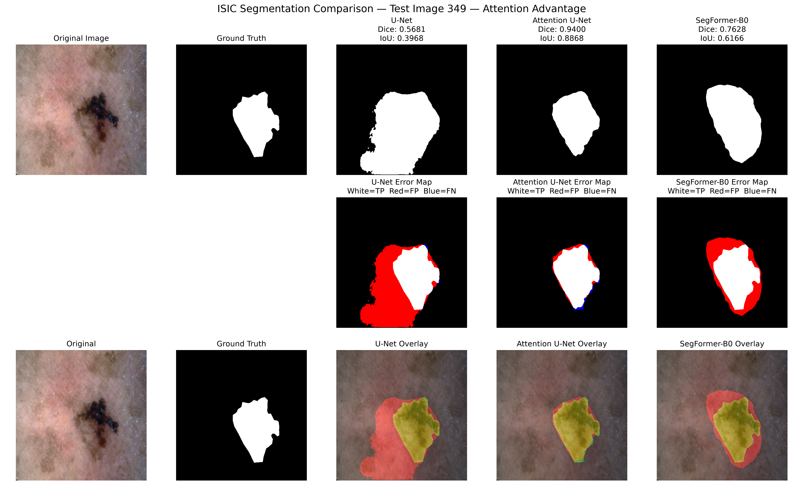
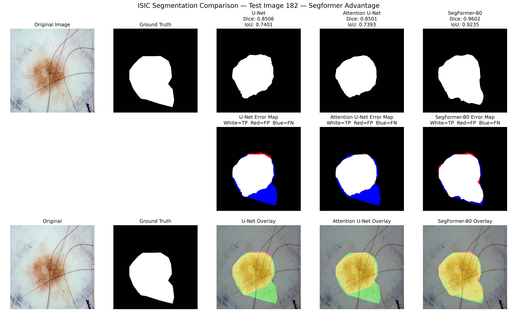
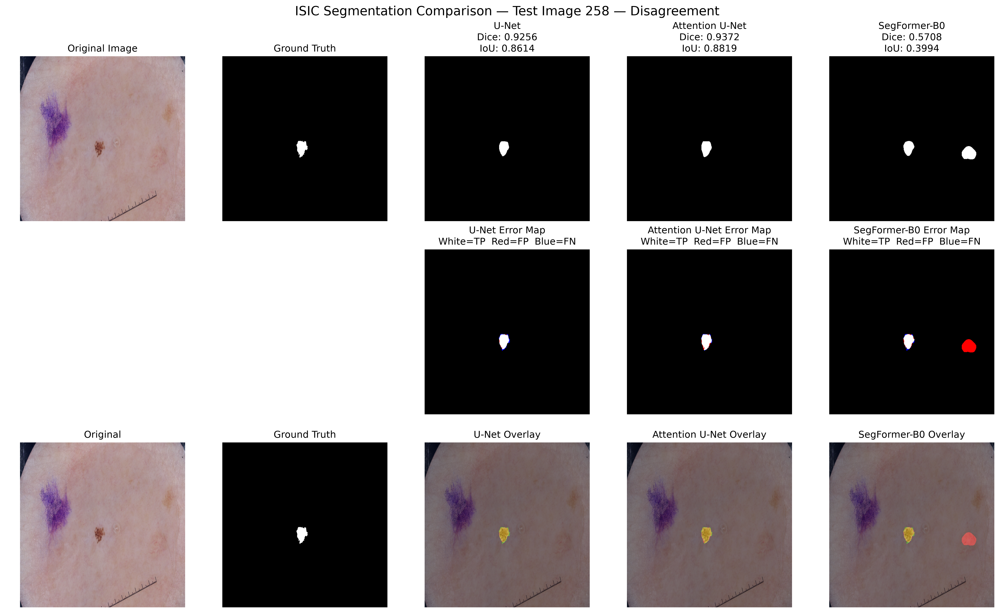

# Skin Lesion Segmentation
Skin lesion segmentation with **U-Net**, **Attention U-Net**, and **SegFormer-B0**, including performance, efficiency, and lesion-size analysis.

---

## Overview
The project evaluates the models from both **segmentation quality** and **computational efficiency** perspectives.

The experiments include:

- Training and validation analysis
- Test set evaluation using Dice, IoU, Precision, Recall, and F1-score
- Inference speed, parameter count, and GPU memory analysis
- Lesion size analysis for small, medium, and large lesions
- Qualitative comparison of segmentation predictions

---

## Dataset
**ISIC 2018 Task 1 — Skin Lesion Segmentation**

The dataset contains **2,595 images**, with a separate test set of **390 images** used for final evaluation.

---

## Main Results

| Model               |       Dice |        IoU | Parameters |       FPS |
| ------------------- | ---------: | ---------: | ---------: | --------: |
| U-Net               |     0.8987 |     0.8337 |     24.44M |     26.12 |
| Attention U-Net     | **0.9058** | **0.8436** |     31.78M |     24.13 |
| SegFormer-B0        |     0.8975 |     0.8330 |  **3.71M** | **33.14** |

**Attention U-Net** achieved the best overall segmentation performance, while **SegFormer-B0** provided the best parameter efficiency and inference speed.

---

## Lesion Size Analysis
To determine whether segmentation performance depended on lesion size, the 390 test images were divided into three groups according to the percentage of image pixels occupied by the ground-truth lesion.

**Lesion distribution**

| Lesion size | Number of images | Percentage |
| ----------- | ---------------: | ---------: |
| Small       |               92 |      23.6% |
| Medium      |              151 |      38.7% |
| Large       |              147 |      37.7% |

### Performance by lesion size

**Dice**

| Lesion size |      U-Net | Attention U-Net | SegFormer-B0 |
| ----------- | ---------: | --------------: | -----------: |
| Small       | **0.8963** |          0.8954 |       0.8903 |
| Medium      |     0.9061 |      **0.9114** |       0.8979 |
| Large       |     0.8925 |      **0.9065** |       0.9016 |

**IoU**

| Lesion size |      U-Net | Attention U-Net | SegFormer-B0 |
| ----------- | ---------: | --------------: | -----------: |
| Small       | **0.8301** |          0.8300 |       0.8221 |
| Medium      |     0.8402 |      **0.8486** |       0.8303 |
| Large       |     0.8292 |      **0.8470** |       0.8425 |

**Attention U-Net** achieved the highest Dice and IoU for both medium and large lesions.
For small lesions, **U-Net** achieved the highest scores, but the difference from **Attention U-Net** was extremely small.

---

## Qualitative Comparison

Qualitative analysis was performed by comparing model predictions against the ground-truth masks.

The analysis included:

- Representative successful cases
- Difficult cases
- Cases where Attention U-Net outperformed U-Net
- Cases where SegFormer-B0 outperformed other models
- Cases with substantial disagreement between models

**Example: Attention U-Net advantage**

  

**Example: SegFormer-B0 advantage**

  

**Example: Model disagreement**

  

---

## Discussion

The experiments demonstrate that **Attention U-Net** is the strongest model in terms of **segmentation quality**. It achieves the highest Dice, IoU, Recall, and F1-score on the test set.

**U-Net** remains highly competitive and achieves the highest precision while using less measured peak GPU memory than other models.

**SegFormer-B0** provides a different advantage. Despite having only **3.71M parameters**, it achieves a Dice score of **0.8975**, which is very close to **U-Net**'s **0.8987**, while achieving the highest inference speed of **33.14 FPS**.

The lesion size analysis further shows that **Attention U-Net** performs particularly well for medium and large lesions.

Overall, the experiments reveal a clear trade-off:

**Attention U-Net → best segmentation quality**

**U-Net → strong baseline with low memory usage and high precision**

**SegFormer-B0 → smallest and fastest model with competitive accuracy**

---

## Conclusion

**Attention U-Net** achieved the best overall segmentation performance, improving Dice from **0.8987** with **U-Net** to **0.9058**. **SegFormer-B0** achieved nearly comparable accuracy (Dice **0.8975**) while using **6.58× fewer parameters** and providing the highest inference speed (**33.14 FPS**). These results demonstrate a trade-off between **segmentation quality** and **computational efficiency**, with **Attention U-Net** being the strongest choice when accuracy is prioritized and **SegFormer-B0** being attractive when model compactness and inference speed are prioritized.

